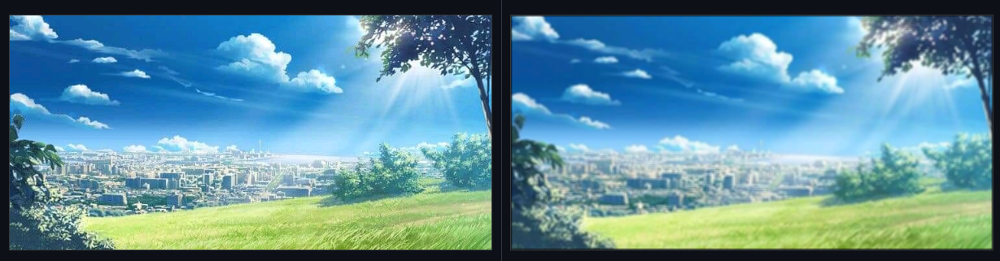
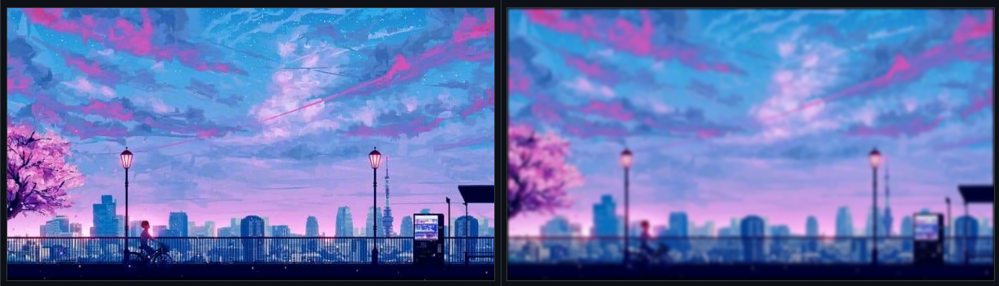

## Blur Effect
Implementation of blur effect using SDL2.

## Screenshot
<figure>
    
    <figcaption>box blur, extent = 1</figcaption>
</figure>
<figure>
    
    <figcaption>gaussian blur, radius = 5</figcaption>
</figure>